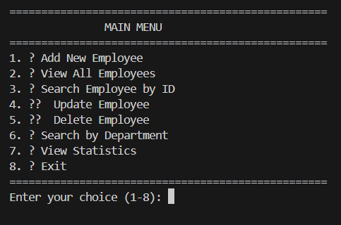
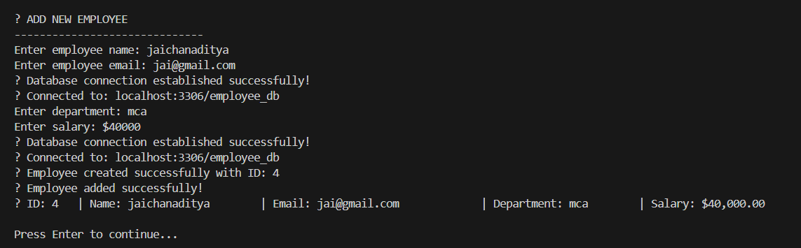
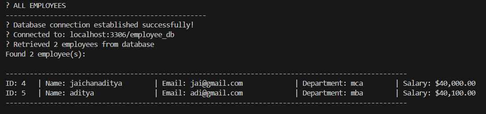
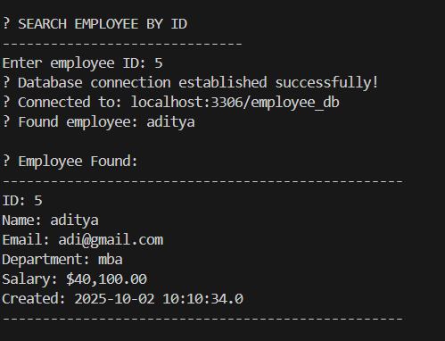
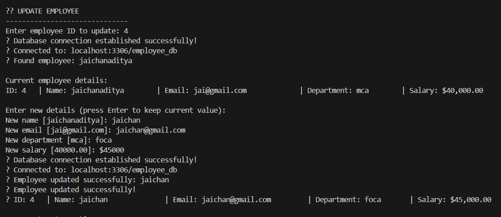
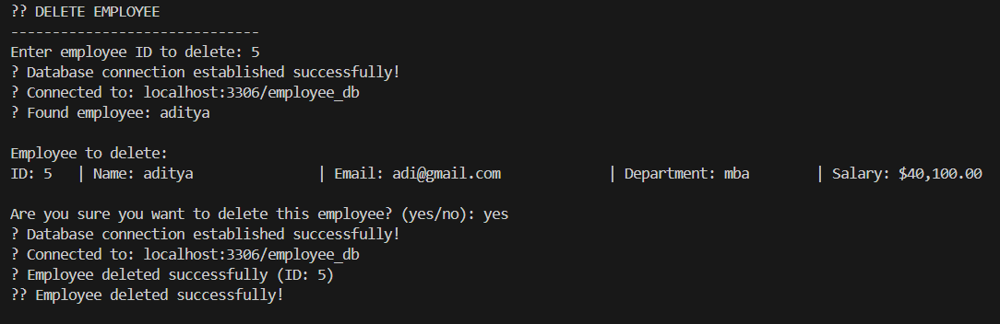
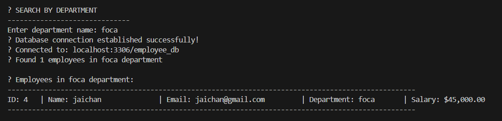
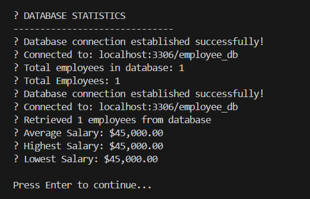
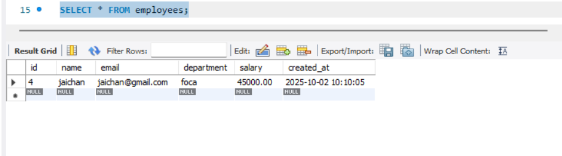

# 🏢 Employee Database Management System

<div align="center">


</div>

A comprehensive Java JDBC application for managing employee records with full CRUD (Create, Read, Update, Delete) operations using MySQL database. Features a user-friendly console interface, secure environment-based configuration, and robust error handling.

<div align="center">

## 📸 Application Screenshots

### 🏠 Main Menu Interface


### ➕ Add New Employee


### 📋 View All Employees


### 🔍 Search Employee by ID


### ✏️ Update Employee


### 🗑️ Delete Employee


### 🏢 Search by Department


### 📊 Database Statistics


### 📊 Database output


### Database Schema Diagram
```
┌─────────────────────────────────┐
│            employees            │
├─────────────────────────────────┤
│ id (INT, AUTO_INCREMENT, PK)    │
│ name (VARCHAR(100), NOT NULL)   │
│ email (VARCHAR(100), UNIQUE)    │
│ department (VARCHAR(50))        │
│ salary (DECIMAL(10,2))          │
│ created_at (TIMESTAMP)          │
└─────────────────────────────────┘
```

</div>

## 🚀 Features

- **Add Employee**: Create new employee records with name, email, department, and salary
- **View All Employees**: Display all employees in a formatted table
- **Search by ID**: Find specific employees by their unique ID
- **Update Employee**: Modify existing employee information
- **Delete Employee**: Remove employee records from database
- **Search by Department**: Filter employees by their department
- **Statistics**: View database statistics including total employees, average salary, etc.
- **Input Validation**: Comprehensive validation for all user inputs
- **Error Handling**: Robust error handling for database operations

## 🛠️ Technologies Used

- **Java 11+**: Core programming language
- **JDBC**: Database connectivity
- **MySQL**: Database management system
- **Maven**: Build and dependency management

## 📋 Prerequisites

Before running this application, make sure you have:

1. **Java 11 or higher** installed
2. **MySQL Server** running
3. **Maven** installed (for dependency management)
4. **MySQL Workbench** (optional, for database management)

## 🗄️ Database Setup

1. Start MySQL Server
2. Create the database and table using the following SQL commands:

```sql
CREATE DATABASE employee_db;
USE employee_db;

CREATE TABLE employees (
    id INT AUTO_INCREMENT PRIMARY KEY,
    name VARCHAR(100) NOT NULL,
    email VARCHAR(100) UNIQUE NOT NULL,
    department VARCHAR(50) NOT NULL,
    salary DECIMAL(10,2) NOT NULL,
    created_at TIMESTAMP DEFAULT CURRENT_TIMESTAMP
);

-- Optional: Insert sample data
INSERT INTO employees (name, email, department, salary) VALUES
('John Doe', 'john.doe@company.com', 'IT', 75000.00),
('Jane Smith', 'jane.smith@company.com', 'HR', 65000.00),
('Mike Johnson', 'mike.johnson@company.com', 'Finance', 80000.00);
```

## ⚙️ Configuration

### 🔐 Environment Variables Setup (Recommended)

For security, this application uses environment variables to store sensitive database credentials:

1. **Copy the environment template:**
   ```bash
   cp .env.example .env
   ```

2. **Update the `.env` file with your database credentials:**
   ```env
   DB_HOST=localhost
   DB_PORT=3306
   DB_NAME=employee_db
   DB_USERNAME=root
   DB_PASSWORD=your_actual_mysql_password
   DB_DRIVER=com.mysql.cj.jdbc.Driver
   ```

3. **The `.env` file is automatically ignored by git** to prevent accidental commits of sensitive data.

### 🔧 Alternative: System Environment Variables

You can also set these as system environment variables instead of using the `.env` file.

## 🏃‍♂️ Running the Application

### 🚀 Quick Start (Windows):

```bash
# 1. Build the project (downloads dependencies and compiles)
./build.bat

# 2. Run the application  
./run.bat
```

### 🐧 Linux/Mac:

```bash
# 1. Make scripts executable
chmod +x build.sh run.sh

# 2. Build and run
./build.sh && ./run.sh
```

### 📋 Manual Setup:

```bash
# 1. Download MySQL Connector
# Download mysql-connector-j-8.0.33.jar to lib/ directory

# 2. Compile
javac -cp "lib/mysql-connector-j-8.0.33.jar" -d "target/classes" src/main/java/com/employee/*.java

# 3. Run
java -cp "target/classes:lib/mysql-connector-j-8.0.33.jar" com.employee.EmployeeApp
```

### 🔧 Using Maven (if installed):

```bash
mvn clean compile exec:java -Dexec.mainClass="com.employee.EmployeeApp"
```

## 📱 Application Menu

When you run the application, you'll see an interactive menu:

```
==================================================
    🏢 EMPLOYEE DATABASE MANAGEMENT SYSTEM 🏢
==================================================

               MAIN MENU
==================================================
1. ➕ Add New Employee
2. 📋 View All Employees
3. 🔍 Search Employee by ID
4. ✏️  Update Employee
5. 🗑️  Delete Employee
6. 🏢 Search by Department
7. 📊 View Statistics
8. 🚪 Exit
==================================================
```

## 🏗️ Project Structure

```
src/
├── main/
│   ├── java/
│   │   └── com/
│   │       └── employee/
│   │           ├── DatabaseConnection.java    # Database connection utility
│   │           ├── Employee.java             # Employee model (POJO)
│   │           ├── EmployeeDAO.java          # Data Access Object
│   │           └── EmployeeApp.java          # Main application
│   └── resources/
│       └── database.properties               # Database configuration
└── test/
    └── java/                                # Test files (for future use)
```

## 🔧 Key Components

### 🏗️ Architecture Overview

```
┌─────────────────┐    ┌──────────────────┐    ┌─────────────────┐
│   EmployeeApp   │    │   EmployeeDAO    │    │ DatabaseConnection │
│   (Main Class)  │───▶│ (Data Access)    │───▶│   (DB Utility)    │
│                 │    │                  │    │                   │
│ • User Interface│    │ • CRUD Operations│    │ • Connection Mgmt │
│ • Input Validation│   │ • PreparedStmt   │    │ • Env Variables   │
│ • Menu System   │    │ • Error Handling │    │ • Security        │
└─────────────────┘    └──────────────────┘    └─────────────────┘
         │                       │                       │
         │                       │                       │
         ▼                       ▼                       ▼
┌─────────────────┐    ┌──────────────────┐    ┌─────────────────┐
│    Employee     │    │   EnvLoader      │    │    MySQL DB     │
│   (Model/POJO)  │    │ (Config Loader)  │    │   employee_db   │
│                 │    │                  │    │                 │
│ • Data Model    │    │ • .env Parser    │    │ • employees     │
│ • Getters/Setters│    │ • Secure Config  │    │   table         │
│ • Validation    │    │ • Fallback       │    │                 │
└─────────────────┘    └──────────────────┘    └─────────────────┘
```

### 📋 Component Details

**1. 🎯 Employee.java**
- Plain Old Java Object (POJO) representing the Employee entity
- Contains all employee fields with getters/setters
- Includes utility methods for display and comparison

**2. 🔗 DatabaseConnection.java**
- Manages database connections using environment variables
- Secure configuration loading via EnvLoader
- Provides connection testing and cleanup methods

**3. 🗄️ EmployeeDAO.java**
- Data Access Object implementing all CRUD operations
- Uses PreparedStatement for SQL injection prevention
- Includes additional utility methods (count, search by department, etc.)

**4. 🖥️ EmployeeApp.java**
- Main application with interactive console interface
- Comprehensive input validation and error handling
- User-friendly menu system with emojis and formatting

**5. 🔐 EnvLoader.java**
- Secure environment variable loader
- Reads from .env file or system environment variables
- Prevents sensitive data exposure in code

## 🔒 Security Features

- 🛡️ **SQL Injection Prevention**: Uses PreparedStatement for all database queries
- ✅ **Input Validation**: Validates all user inputs before processing
- 📧 **Email Uniqueness**: Prevents duplicate email addresses
- 🔐 **Environment Variables**: Sensitive data stored in .env file (git-ignored)
- 🚫 **No Hardcoded Credentials**: Database credentials never committed to version control
- ⚡ **Error Handling**: Graceful handling of database errors and exceptions
- 🔍 **Configuration Validation**: Checks database connectivity on startup

## 🚀 Getting Started for GitHub

### 🔄 Cloning and Setup

```bash
# 1. Clone the repository
git clone https://github.com/yourusername/employee-database-app.git
cd employee-database-app

# 2. Set up environment variables
cp .env.example .env

# 3. Edit .env file with your database credentials
# Update DB_PASSWORD with your actual MySQL password

# 4. Set up MySQL database
mysql -u root -p < database/setup.sql

# 5. Download dependencies and compile
./build.bat  # On Windows
# OR
mvn clean compile  # If Maven is installed
```

### 🗄️ Database Setup Script

Create `database/setup.sql`:
```sql
CREATE DATABASE IF NOT EXISTS employee_db;
USE employee_db;

CREATE TABLE employees (
    id INT AUTO_INCREMENT PRIMARY KEY,
    name VARCHAR(100) NOT NULL,
    email VARCHAR(100) UNIQUE NOT NULL,
    department VARCHAR(50) NOT NULL,
    salary DECIMAL(10,2) NOT NULL,
    created_at TIMESTAMP DEFAULT CURRENT_TIMESTAMP
);

INSERT INTO employees (name, email, department, salary) VALUES
('John Doe', 'john.doe@company.com', 'IT', 75000.00),
('Jane Smith', 'jane.smith@company.com', 'HR', 65000.00),
('Mike Johnson', 'mike.johnson@company.com', 'Finance', 80000.00);
```

## 📊 Sample Operations

### Adding an Employee:
```
📝 ADD NEW EMPLOYEE
------------------------------
Enter employee name: Alice Johnson
Enter employee email: alice.johnson@company.com
Enter department: Marketing
Enter salary: $70000.00
✅ Employee created successfully with ID: 4
```

### Viewing All Employees:
```
📋 ALL EMPLOYEES
--------------------------------------------------
Found 4 employee(s):

ID: 1   | Name: John Doe           | Email: john.doe@company.com     | Department: IT        | Salary: $75,000.00
ID: 2   | Name: Jane Smith         | Email: jane.smith@company.com   | Department: HR        | Salary: $65,000.00
ID: 3   | Name: Mike Johnson       | Email: mike.johnson@company.com | Department: Finance   | Salary: $80,000.00
ID: 4   | Name: Alice Johnson      | Email: alice.johnson@company.com| Department: Marketing | Salary: $70,000.00
```

## 🧪 Testing

The application includes comprehensive error handling and validation:

- Database connection testing on startup
- Input validation for all fields
- Duplicate email prevention
- Proper error messages for all failure scenarios


**❌ Error Handling:**
```
❌ Please enter a valid email!
❌ Employee with this email already exists!
❌ Salary must be greater than 0!
❌ No employee found with ID: 999
💡 Please check your .env file configuration
```

## 🎨 Repository Structure

```
employee-database-app/
├── 📁 src/
│   └── main/
│       ├── java/com/employee/
│       │   ├── 🏢 EmployeeApp.java      # Main application
│       │   ├── 👤 Employee.java         # Data model
│       │   ├── 🗄️ EmployeeDAO.java      # Database operations
│       │   ├── 🔗 DatabaseConnection.java # DB connection
│       │   └── 🔐 EnvLoader.java        # Environment loader
│       └── resources/
│           └── 📄 database.properties   # DB config (legacy)
├── 📁 database/
│   └── 📝 setup.sql                    # Database setup script
├── 📁 lib/                             # External libraries
├── 📁 target/                          # Compiled classes
├── 📁 screenshots/                     # App screenshots & demos
├── 🔧 .env.example                     # Environment template
├── 🚫 .gitignore                       # Git ignore rules
├── 🔨 build.bat / build.sh             # Build scripts
├── 🚀 run.bat / run.sh                 # Run scripts
├── 📖 README.md                        # This file
└── 📦 pom.xml                          # Maven configuration
```


<div align="center">

### ⭐ Star this repository if you found it helpful!

Made with ❤️ and ☕ for learning Java JDBC

### 📸 **Screenshot Documentation**

All screenshots in this README demonstrate real functionality of the application. To replicate:

1. Follow the setup instructions above
2. Run the application: `java -cp "target\classes;lib\mysql-connector-j-8.0.33.jar" com.employee.EmployeeApp`
3. Navigate through each menu option to see the features in action

The application provides a complete console-based interface for managing employee data with professional error handling and user-friendly prompts.

</div>
